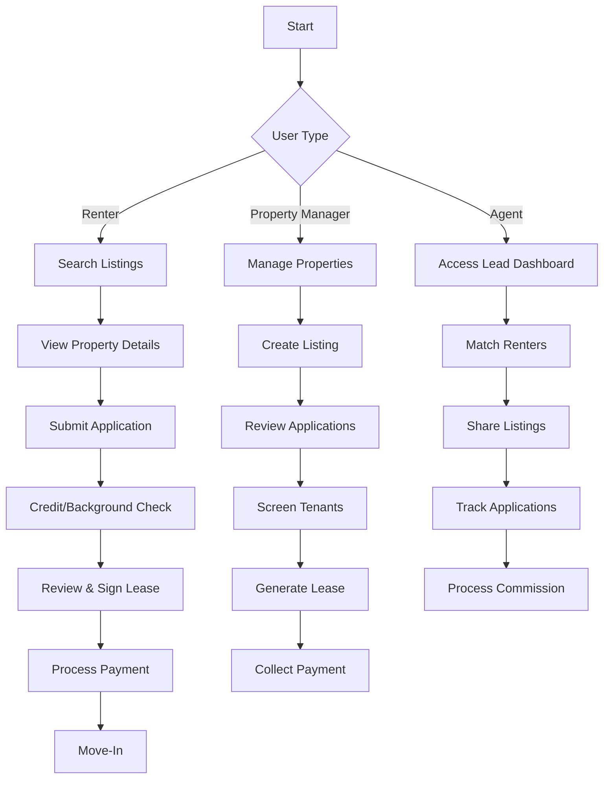
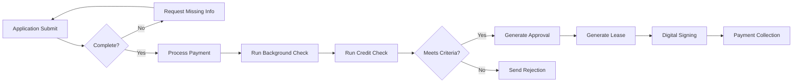
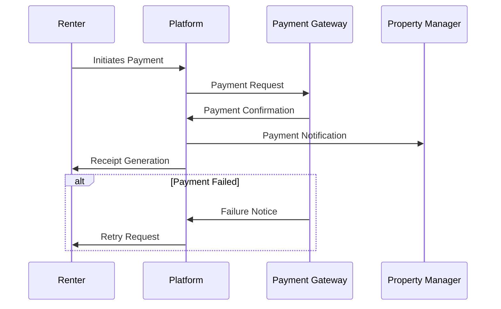
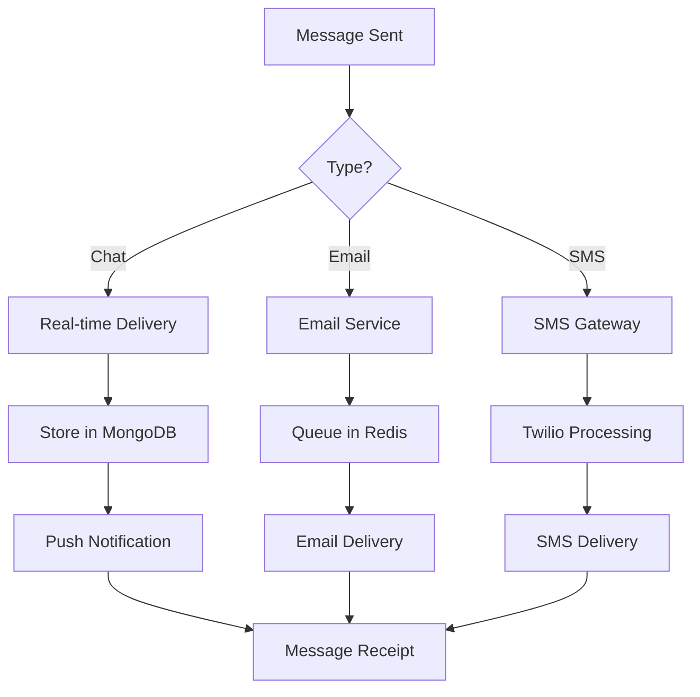
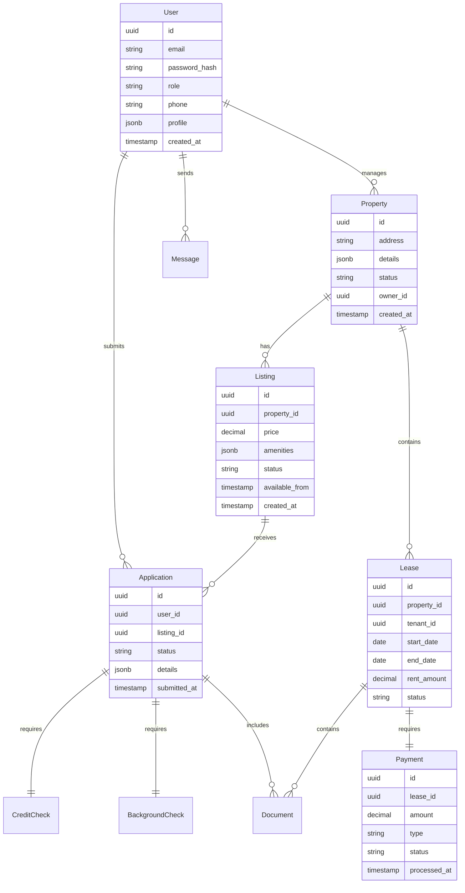
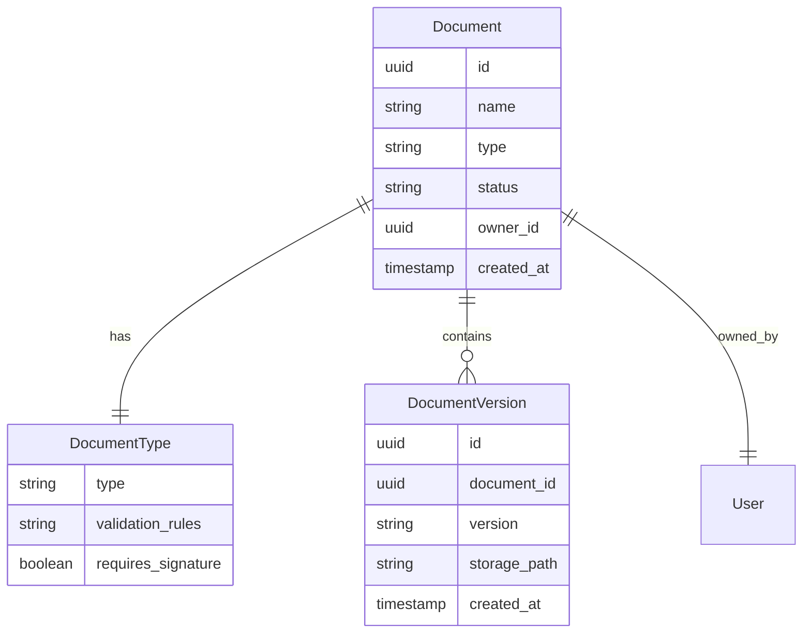
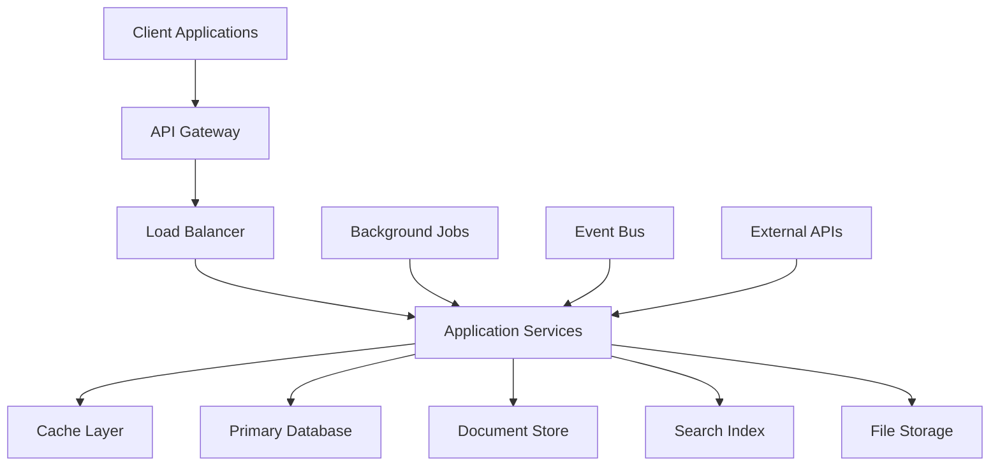

# Product Requirements Document (PRD)

# 1. INTRODUCTION

## 1.1 Purpose

This Software Requirements Specification (SRS) document provides a comprehensive description of the Project X rental marketplace platform. It details the functional and non-functional requirements for developers, project managers, QA teams, and stakeholders involved in the development and implementation of the system. This document will serve as the authoritative reference for technical planning, product development, and validation testing throughout the project lifecycle.

## 1.2 Scope

Project X is a full-stack rental marketplace platform that transforms the traditional apartment leasing process into a streamlined, digital experience. The system encompasses:

### Core Functionalities
- End-to-end rental process automation
- Multi-user platform supporting renters, landlords, property managers, and agents
- Integrated application and screening processes
- Digital lease execution and payment processing
- Real-time communication and notification system

### Key Benefits
- Reduced administrative overhead through automation
- Increased conversion rates for property listings
- Standardized and reusable application processes
- Centralized document management
- Enhanced security and compliance measures
- Seamless integration with existing property management systems

### Technical Boundaries
- Web-based platform with responsive design
- Native mobile applications for iOS and Android
- Microservices architecture deployed on cloud infrastructure
- Integration with third-party services for:
  - Credit and background checks
  - Payment processing
  - Property management software
  - Communication services

### Out of Scope
- Property maintenance management
- In-person viewing scheduling
- Physical key management
- Building security systems
- Utility management and billing

# 2. PRODUCT DESCRIPTION

## 2.1 Product Perspective
Project X operates as a standalone rental marketplace platform while integrating with existing property management ecosystems. The system architecture follows a microservices approach deployed on cloud infrastructure with the following key components:

- Web and mobile client applications
- Backend microservices for core functionalities
- Integration layer for third-party services
- Secure data storage and processing systems
- Real-time communication infrastructure

## 2.2 Product Functions
The platform provides these primary functions:

1. Property Listing Management
   - Automated listing creation and syndication
   - Real-time availability updates
   - Multi-channel listing distribution

2. Application Processing
   - One-click application submission
   - Standardized application templates
   - Document upload and verification
   - Reusable applicant profiles

3. Tenant Screening
   - Automated credit checks
   - Background verification
   - Income verification
   - Rental history validation

4. Lease Management
   - Digital lease generation
   - Electronic signature collection
   - Document storage and retrieval
   - Version control and audit trails

5. Payment Processing
   - Security deposit collection
   - Recurring rent payments
   - Commission disbursement
   - Late fee management

6. Communication System
   - In-app messaging
   - Automated notifications
   - Email and SMS integration
   - Activity tracking

## 2.3 User Characteristics

### Renters
- Tech-savvy young professionals and students
- Age range: 18-45
- Comfortable with digital transactions
- Expects instant responses and mobile access
- May have varying levels of rental experience

### Property Managers/Landlords
- Professional property management staff
- Age range: 30-60
- Varying technical proficiency
- Requires efficient workflow management
- Focuses on portfolio optimization

### Real Estate Agents
- Licensed professionals
- Age range: 25-55
- Mobile-first users
- Needs quick access to property information
- Commission-driven workflow

## 2.4 Constraints

### Technical Constraints
- Must maintain 99.9% uptime for critical functions
- Maximum response time of 2 seconds for user interactions
- Mobile app size limited to 50MB
- Support for browsers with >1% market share
- Compliance with OAuth 2.0 and OpenID Connect standards

### Business Constraints
- Must integrate with major property management systems
- Regulatory compliance with real estate laws
- Payment processing fees within industry standards
- Support for multiple languages and currencies
- Data retention policies alignment with legal requirements

### Security Constraints
- SOC 2 Type II compliance required
- GDPR and CCPA compliance
- Multi-factor authentication implementation
- Regular security audits and penetration testing
- Encrypted data storage and transmission

## 2.5 Assumptions and Dependencies

### Assumptions
- Users have reliable internet connectivity
- Property managers maintain accurate listing information
- Third-party services maintain their API specifications
- Mobile devices support required security features
- Users accept digital document signing

### Dependencies
- Third-party credit check services availability
- Payment gateway uptime and performance
- Property management software APIs
- Cloud infrastructure reliability
- Government ID verification services
- Electronic signature service providers
- SMS and email delivery services

# 3. PROCESS FLOWCHART

The following flowcharts illustrate the core processes within Project X:

## 3.1 Main User Flows



## 3.2 Application Processing Flow



## 3.3 Payment Processing Flow



## 3.4 Communication Flow



# 4. FUNCTIONAL REQUIREMENTS

## 4.1 Property Listing Management

### ID: F-100
### Description
System for creating, managing, and syndicating property listings across multiple channels.
### Priority: High
### Requirements

| ID | Requirement | Priority |
|---|---|---|
| F-101 | Property managers can create listings with photos, descriptions, amenities, and pricing | High |
| F-102 | System automatically syndicates listings to partner platforms via API | High |
| F-103 | Real-time availability updates across all channels | High |
| F-104 | Bulk listing upload via CSV/Excel templates | Medium |
| F-105 | Custom fields for property-specific features and requirements | Medium |
| F-106 | Automated listing deactivation when unit is rented | High |

## 4.2 Application Processing

### ID: F-200
### Description
End-to-end application submission and processing system with reusable profiles.
### Priority: High
### Requirements

| ID | Requirement | Priority |
|---|---|---|
| F-201 | One-click application submission using saved profiles | High |
| F-202 | Document upload and verification system | High |
| F-203 | Co-signer support with separate application flow | Medium |
| F-204 | Application progress tracking and status updates | High |
| F-205 | Automated completeness check and validation | High |
| F-206 | Application template customization for property managers | Medium |

## 4.3 Tenant Screening

### ID: F-300
### Description
Automated screening process including credit, background, and income verification.
### Priority: High
### Requirements

| ID | Requirement | Priority |
|---|---|---|
| F-301 | Integration with credit reporting agencies via API | High |
| F-302 | Automated background check processing | High |
| F-303 | Income verification through bank statements or pay stubs | High |
| F-304 | Rental history verification system | Medium |
| F-305 | Customizable screening criteria per property | High |
| F-306 | Automated approval/rejection based on criteria | High |

## 4.4 Lease Management

### ID: F-400
### Description
Digital lease generation, execution, and storage system.
### Priority: High
### Requirements

| ID | Requirement | Priority |
|---|---|---|
| F-401 | Dynamic lease document generation | High |
| F-402 | Electronic signature collection via secure platform | High |
| F-403 | Document version control and audit trail | High |
| F-404 | Automated reminder system for pending signatures | Medium |
| F-405 | Secure document storage and retrieval | High |
| F-406 | Custom clause library for lease customization | Medium |

## 4.5 Payment Processing

### ID: F-500
### Description
Comprehensive payment handling system for deposits, rent, and fees.
### Priority: High
### Requirements

| ID | Requirement | Priority |
|---|---|---|
| F-501 | Security deposit collection and processing | High |
| F-502 | Recurring rent payment scheduling | High |
| F-503 | Late fee calculation and collection | Medium |
| F-504 | Commission disbursement to agents | Medium |
| F-505 | Payment history tracking and reporting | High |
| F-506 | Multiple payment method support (ACH, credit card) | High |

## 4.6 Communication System

### ID: F-600
### Description
Integrated messaging and notification platform for all users.
### Priority: High
### Requirements

| ID | Requirement | Priority |
|---|---|---|
| F-601 | Real-time in-app messaging between users | High |
| F-602 | Automated email notifications for key events | High |
| F-603 | SMS notifications for time-sensitive updates | Medium |
| F-604 | Message history and activity tracking | Medium |
| F-605 | Template-based communication system | Medium |
| F-606 | File sharing within messaging system | Medium |

# 5. NON-FUNCTIONAL REQUIREMENTS

## 5.1 Performance Requirements

| Requirement | Description | Target Metric |
|------------|-------------|---------------|
| Response Time | Maximum time for page loads and API responses | < 2 seconds at 95th percentile |
| API Latency | Maximum latency for API endpoints | < 500ms at 99th percentile |
| Database Query Time | Maximum time for database operations | < 100ms for 95% of queries |
| Mobile App Launch Time | Time from launch to interactive state | < 3 seconds on 4G networks |
| Concurrent Users | Maximum simultaneous users supported | 100,000 active sessions |
| File Upload Speed | Maximum time for document uploads | < 5 seconds for 10MB files |
| Search Results | Maximum time to return search results | < 1 second for filtered queries |

## 5.2 Safety Requirements

| Requirement | Description | Implementation |
|------------|-------------|----------------|
| Data Backup | Regular automated backups of all system data | Daily incremental, weekly full backups |
| Disaster Recovery | Recovery point and time objectives | RPO: 1 hour, RTO: 4 hours |
| Failover Systems | Automatic failover for critical services | Multi-region deployment on AWS |
| Data Validation | Input validation to prevent system corruption | Server-side validation for all inputs |
| Transaction Integrity | Ensure payment transaction consistency | Two-phase commit protocol |
| Error Handling | Graceful degradation of services | Circuit breaker pattern implementation |
| Audit Logging | Track all system modifications | Immutable audit logs in separate storage |

## 5.3 Security Requirements

| Requirement | Description | Implementation |
|------------|-------------|----------------|
| Authentication | User identity verification | OAuth 2.0 with OpenID Connect |
| Authorization | Role-based access control | RBAC with JWT tokens |
| Data Encryption | Protection of sensitive data | AES-256 at rest, TLS 1.3 in transit |
| Password Policy | Secure password requirements | Min 12 chars, complexity rules |
| Session Management | Secure session handling | HTTP-only cookies, session timeouts |
| API Security | Protection of API endpoints | Rate limiting, API keys, IP whitelisting |
| Vulnerability Scanning | Regular security assessments | Weekly automated scans |

## 5.4 Quality Requirements

### 5.4.1 Availability
- System uptime: 99.9% excluding planned maintenance
- Maximum planned downtime: 4 hours per month
- Redundant infrastructure across multiple availability zones

### 5.4.2 Maintainability
- Microservices architecture with loose coupling
- Automated deployment pipelines
- Comprehensive API documentation
- Code coverage minimum: 80%
- Automated testing requirements: Unit, Integration, E2E

### 5.4.3 Usability
- Mobile-first responsive design
- WCAG 2.1 Level AA compliance
- Maximum of 3 clicks to complete primary actions
- Support for screen readers and accessibility tools
- Multi-language support for major markets

### 5.4.4 Scalability
- Horizontal scaling capability for all services
- Auto-scaling based on CPU/memory metrics
- Database sharding for large datasets
- CDN implementation for static assets
- Caching strategy for frequently accessed data

### 5.4.5 Reliability
- Mean Time Between Failures (MTBF): > 720 hours
- Mean Time To Recovery (MTTR): < 30 minutes
- Error rate: < 0.1% for all transactions
- Zero data loss guarantee for financial transactions
- Automated system health monitoring

## 5.5 Compliance Requirements

| Requirement | Description | Implementation |
|------------|-------------|----------------|
| Data Privacy | GDPR and CCPA compliance | Data minimization, right to be forgotten |
| Financial Security | PCI DSS compliance | Level 1 PCI DSS certification |
| Accessibility | ADA compliance | WCAG 2.1 Level AA standards |
| Security Standards | SOC 2 Type II compliance | Annual audit and certification |
| Fair Housing | HUD compliance | Automated listing review process |
| Electronic Signatures | ESIGN Act compliance | Qualified electronic signatures |
| Data Retention | Legal requirements for records | Configurable retention policies |

# 6. DATA REQUIREMENTS

## 6.1 Data Models

### 6.1.1 Core Entity Relationships



### 6.1.2 Document Management Model



## 6.2 Data Storage

### 6.2.1 Primary Storage Systems

| Data Type | Storage System | Purpose |
|-----------|---------------|----------|
| Structured Data | PostgreSQL | User profiles, properties, applications |
| Document Storage | MongoDB | Messages, activity logs, notifications |
| File Storage | AWS S3 | Documents, images, lease agreements |
| Cache Layer | Redis | Session data, frequent queries |
| Search Index | Elasticsearch | Property and listing search |

### 6.2.2 Data Retention Policies

| Data Category | Retention Period | Storage Location |
|---------------|-----------------|------------------|
| User Accounts | 7 years after last activity | PostgreSQL + Archive |
| Applications | 3 years | PostgreSQL + Archive |
| Messages | 2 years | MongoDB + Archive |
| Lease Documents | 10 years | S3 + Glacier |
| Payment Records | 7 years | PostgreSQL + Archive |
| System Logs | 1 year | MongoDB + Archive |

### 6.2.3 Backup and Recovery

- Daily incremental backups to separate AWS region
- Weekly full backups with 90-day retention
- Point-in-time recovery capability for last 35 days
- Cross-region replication for critical data
- Automated backup testing monthly
- Recovery time objective (RTO): 4 hours
- Recovery point objective (RPO): 1 hour

## 6.3 Data Processing

### 6.3.1 Data Flow Architecture



### 6.3.2 Data Security Measures

| Security Layer | Implementation |
|----------------|----------------|
| Encryption at Rest | AES-256 encryption for all stored data |
| Encryption in Transit | TLS 1.3 for all data transmission |
| Access Control | RBAC with JWT tokens |
| Data Masking | PII and sensitive data masking in logs |
| Key Management | AWS KMS for encryption key management |
| Audit Logging | Immutable audit trails for all data changes |

### 6.3.3 Data Processing Rules

| Process Type | Rules |
|-------------|-------|
| Input Validation | Server-side validation for all user inputs |
| Data Transformation | Standardization of addresses and phone numbers |
| Data Enrichment | Automatic geocoding for property addresses |
| Data Quality | Automated data quality checks and cleanup |
| Data Integration | Real-time synchronization with external systems |
| Error Handling | Retry mechanisms with exponential backoff |

# 7. EXTERNAL INTERFACES

## 7.1 User Interfaces

### 7.1.1 Web Application Interface

| Component | Requirements |
|-----------|--------------|
| Framework | React with Next.js |
| Design System | Material-UI v5 |
| Responsive Breakpoints | Mobile (<768px), Tablet (768-1024px), Desktop (>1024px) |
| Accessibility | WCAG 2.1 Level AA compliant |
| Supported Browsers | Chrome 90+, Firefox 88+, Safari 14+, Edge 90+ |
| Minimum Resolution | 320px x 568px |

### 7.1.2 Mobile Application Interface

| Component | Requirements |
|-----------|--------------|
| iOS Framework | Swift UI |
| Android Framework | Kotlin with Jetpack Compose |
| Minimum iOS Version | iOS 14.0 |
| Minimum Android Version | Android 8.0 (API 26) |
| Design Guidelines | iOS Human Interface Guidelines, Material Design 3 |
| Offline Capabilities | Basic listing browsing and saved application data |

## 7.2 Hardware Interfaces

### 7.2.1 Mobile Device Requirements

| Feature | Specification |
|---------|--------------|
| Camera Access | Required for document scanning and property photos |
| GPS/Location | Required for property proximity search |
| Biometric Sensors | Optional for secure login (TouchID/FaceID) |
| Storage | Minimum 100MB free space |
| Network | 4G LTE or WiFi connection |

### 7.2.2 IoT Integration Requirements

| Device Type | Interface Specification |
|-------------|------------------------|
| Smart Locks | BLE 4.0+ for remote access |
| Security Cameras | RTSP/WebRTC for live streaming |
| Access Control Systems | REST API over HTTPS |

## 7.3 Software Interfaces

### 7.3.1 Third-Party Service Integrations

| Service Type | Provider | Interface Method |
|-------------|----------|------------------|
| Credit Check | Experian | REST API with OAuth 2.0 |
| Background Check | Checkr | GraphQL API |
| Payment Processing | Stripe | REST API with Webhooks |
| Document Signing | DocuSign | REST API with JWT |
| Property Management | Yardi, AppFolio | REST API with API Keys |
| Banking | Plaid | REST API with OAuth 2.0 |

### 7.3.2 External System Dependencies

| System | Integration Type | Data Exchange Format |
|--------|-----------------|---------------------|
| MLS Listings | RETS or REST API | JSON/XML |
| Tax Assessment | SOAP API | XML |
| Insurance Verification | REST API | JSON |
| Address Verification | REST API | JSON |
| Email Service | SMTP/API | MIME/JSON |

## 7.4 Communication Interfaces

### 7.4.1 Network Protocols

| Protocol | Usage | Specification |
|----------|-------|---------------|
| HTTPS | All API Communication | TLS 1.3 |
| WebSocket | Real-time Messaging | WSS with Socket.io |
| MQTT | IoT Device Communication | v5.0 over TLS |
| GraphQL | Complex Data Queries | Apollo Federation |

### 7.4.2 API Specifications

```yaml
openapi: 3.0.0
info:
  title: Project X API
  version: 1.0.0
security:
  - bearerAuth: []
paths:
  /api/v1:
    description: RESTful endpoints
  /graphql:
    description: GraphQL endpoint
  /ws:
    description: WebSocket endpoint
```

### 7.4.3 Message Formats

| Type | Format | Validation |
|------|--------|------------|
| API Requests | JSON | JSON Schema |
| File Uploads | Multipart/form-data | Content-Type verification |
| Real-time Events | JSON over WebSocket | JSON Schema |
| Email Templates | MJML | HTML compliance |
| Push Notifications | FCM/APNS payload | Platform-specific schema |

# 8. APPENDICES

## 8.1 GLOSSARY

| Term | Definition |
|------|------------|
| Listing Syndication | The automated distribution of property listings across multiple rental platforms and websites |
| Co-signer | A person who agrees to be legally responsible for rent payments if the primary tenant defaults |
| Security Deposit | An upfront payment held as security against damage or unpaid rent |
| Lease Agreement | A legal contract between landlord and tenant specifying rental terms and conditions |
| Background Check | Verification of criminal history, eviction records, and other relevant tenant history |
| Credit Check | Review of credit score and financial history to assess tenant reliability |
| Property Manager | Professional responsible for managing rental properties on behalf of owners |
| Digital Lease | Electronic version of a lease agreement that can be signed online |
| Rental Application | Formal request to rent a property, including personal and financial information |

## 8.2 ACRONYMS

| Acronym | Full Form |
|---------|-----------|
| API | Application Programming Interface |
| RBAC | Role-Based Access Control |
| MFA | Multi-Factor Authentication |
| CDN | Content Delivery Network |
| JWT | JSON Web Token |
| REST | Representational State Transfer |
| SMTP | Simple Mail Transfer Protocol |
| BLE | Bluetooth Low Energy |
| RTSP | Real Time Streaming Protocol |
| PII | Personally Identifiable Information |
| KMS | Key Management Service |
| RETS | Real Estate Transaction Standard |
| FCM | Firebase Cloud Messaging |
| APNS | Apple Push Notification Service |
| WCAG | Web Content Accessibility Guidelines |
| RPO | Recovery Point Objective |
| RTO | Recovery Time Objective |

## 8.3 ADDITIONAL REFERENCES

| Resource | Description | URL |
|----------|-------------|-----|
| React Documentation | Official documentation for React framework | https://reactjs.org/docs |
| Material-UI Documentation | Component library documentation | https://mui.com/docs |
| AWS Best Practices | Cloud infrastructure guidelines | https://aws.amazon.com/architecture/well-architected |
| WCAG Guidelines | Web accessibility standards | https://www.w3.org/WAI/standards-guidelines/wcag |
| OAuth 2.0 Specification | Authentication protocol documentation | https://oauth.net/2 |
| Stripe API Reference | Payment processing integration guide | https://stripe.com/docs/api |
| DocuSign REST API | Electronic signature integration guide | https://developers.docusign.com |
| Plaid API Documentation | Banking integration documentation | https://plaid.com/docs |
| Twilio API Reference | Communication services integration | https://www.twilio.com/docs |
| Elasticsearch Guide | Search implementation documentation | https://www.elastic.co/guide |