# Technical Specifications

# 1. INTRODUCTION

## 1.1 Executive Summary

Project X is a comprehensive rental marketplace platform designed to transform the traditional apartment leasing process into a seamless digital experience. The system addresses the fundamental inefficiencies in the current rental market by automating and integrating the entire rental lifecycle - from listing to lease signing and payment processing. Built for renters, landlords, property managers, and agents, the platform eliminates manual workflows, reduces administrative overhead, and provides a transparent, efficient rental experience comparable to modern e-commerce transactions.

The platform's value proposition centers on significantly reducing the time-to-lease while increasing conversion rates through automation, standardization, and integration with existing property management systems. By providing a full-stack solution rather than just lead generation, Project X aims to become the definitive operating system for rental property management.

## 1.2 System Overview

### Project Context

| Aspect | Details |
|--------|----------|
| Market Position | First comprehensive end-to-end rental marketplace in the industry |
| Current Limitations | Fragmented tools, manual processes, lack of standardization |
| Enterprise Integration | Seamless integration with major property management systems (Yardi, RealPage, AppFolio) |

### High-Level Description

| Component | Description |
|-----------|-------------|
| Core Platform | Cloud-native microservices architecture deployed on AWS |
| Client Applications | Responsive web application and native mobile apps |
| Integration Layer | API-first design with extensive third-party service integration |
| Data Management | Multi-database architecture with distributed storage |
| Security Framework | Enterprise-grade security with SOC 2 Type II compliance |

### Success Criteria

| KPI Category | Target Metrics |
|--------------|----------------|
| User Adoption | 100,000 active users within 12 months |
| Transaction Volume | $50M in processed rental payments per month |
| Conversion Rate | 40% application-to-lease conversion |
| System Performance | 99.9% uptime, <2s response time |
| Cost Reduction | 60% reduction in administrative overhead |

## 1.3 Scope

### In-Scope Elements

#### Core Features and Functionalities

| Feature Category | Components |
|-----------------|------------|
| Listing Management | Property creation, syndication, availability tracking |
| Application Processing | One-click applications, screening, verification |
| Lease Management | Digital document generation, e-signatures, storage |
| Payment Processing | Deposits, rent collection, commission disbursement |
| Communication | In-app messaging, notifications, activity tracking |

#### Implementation Boundaries

| Boundary Type | Coverage |
|--------------|----------|
| User Groups | Renters, landlords, property managers, agents |
| Geographic Scope | United States initial market |
| Property Types | Residential rentals (apartments, houses, condos) |
| Data Domains | User profiles, properties, applications, leases, payments |

### Out-of-Scope Elements

| Category | Excluded Elements |
|----------|------------------|
| Features | Property maintenance, utility management, insurance |
| Operations | Physical key management, in-person viewing scheduling |
| Property Types | Commercial properties, vacation rentals |
| Markets | International markets (Phase 2) |
| Services | Property valuation, mortgage services |

# 2. SYSTEM ARCHITECTURE

## 2.1 High-Level Architecture

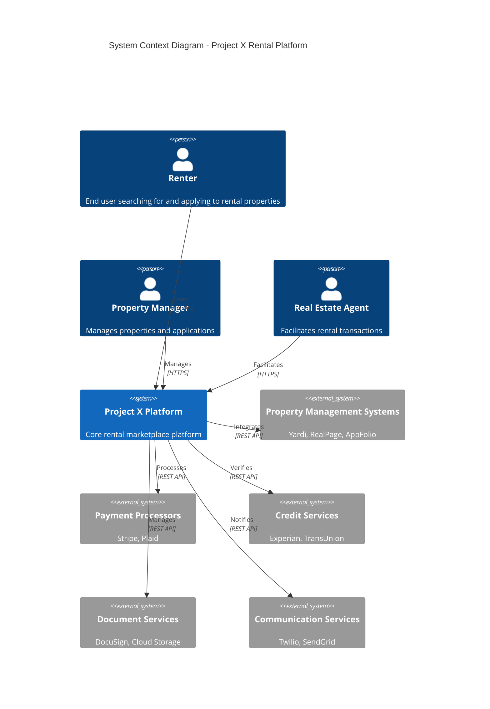

## 2.2 Container Architecture

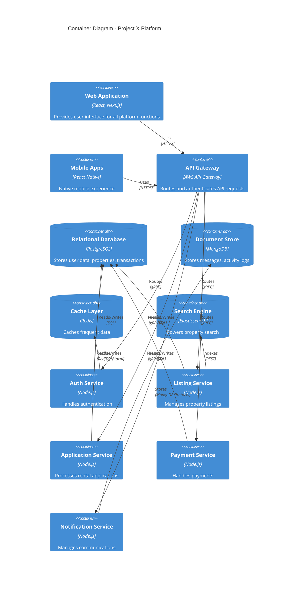

## 2.3 Component Details

### Core Services

| Service | Technology Stack | Purpose | Scaling Strategy |
|---------|-----------------|---------|------------------|
| API Gateway | AWS API Gateway | Request routing, authentication | Horizontal auto-scaling |
| Auth Service | Node.js, JWT | User authentication, authorization | Horizontal scaling |
| Listing Service | Node.js, TypeScript | Property listing management | Horizontal scaling |
| Application Service | Node.js, TypeScript | Rental application processing | Horizontal scaling |
| Payment Service | Node.js, TypeScript | Payment processing | Horizontal scaling |
| Notification Service | Node.js, TypeScript | Communication management | Queue-based scaling |

### Data Storage

| Store Type | Technology | Purpose | Scaling Strategy |
|------------|------------|---------|------------------|
| Primary Database | PostgreSQL | Transactional data | Read replicas, sharding |
| Document Store | MongoDB | Unstructured data | Horizontal sharding |
| Cache Layer | Redis Cluster | Performance optimization | Redis cluster |
| Search Engine | Elasticsearch | Property search | Elasticsearch cluster |
| File Storage | AWS S3 | Document storage | Native S3 scaling |

## 2.4 Data Flow Architecture

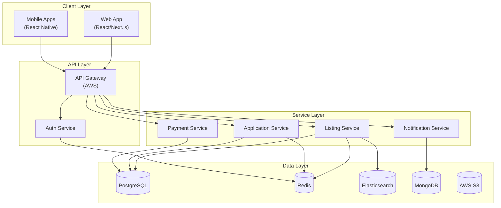

## 2.5 Deployment Architecture

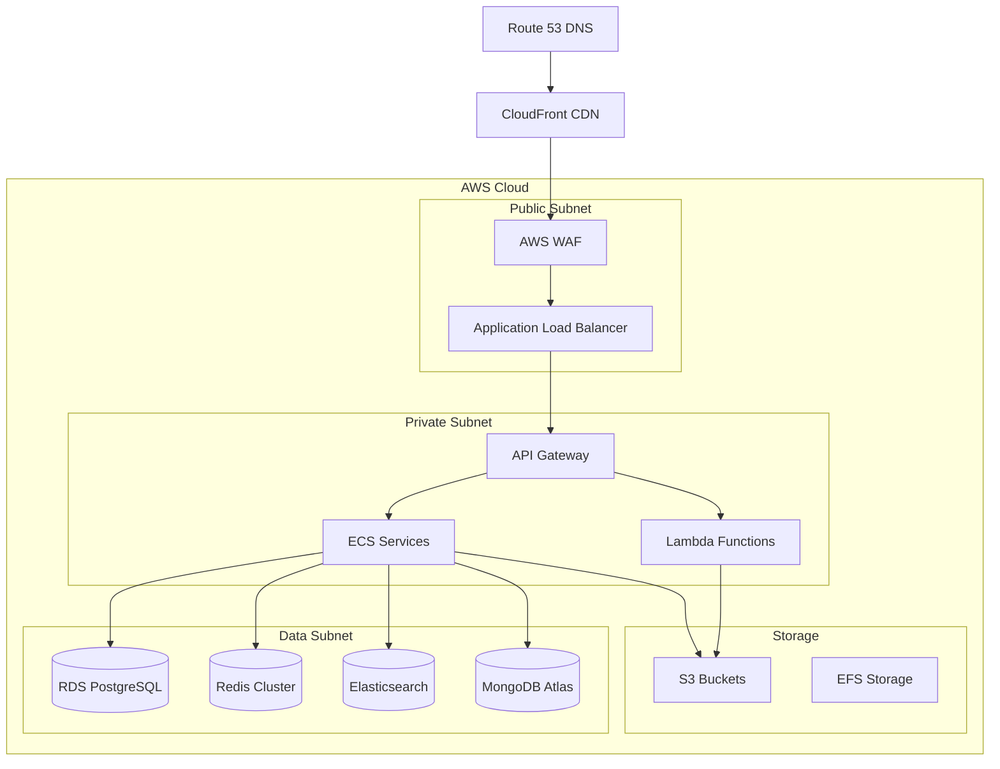

## 2.6 Cross-Cutting Concerns

### Monitoring and Observability

| Component | Tool | Purpose |
|-----------|------|---------|
| Metrics | Prometheus | System metrics collection |
| Logging | ELK Stack | Centralized logging |
| Tracing | Jaeger | Distributed tracing |
| Alerting | PagerDuty | Incident management |
| Dashboard | Grafana | Metrics visualization |

### Security Architecture

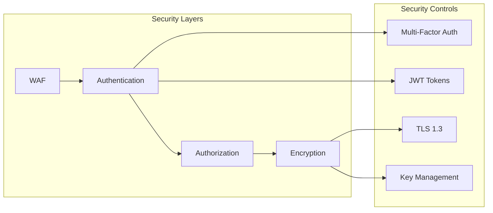

# 3. SYSTEM COMPONENTS ARCHITECTURE

## 3.1 User Interface Design

### 3.1.1 Design System Specifications

| Component | Specification | Details |
|-----------|--------------|---------|
| Typography | System Font Stack | -apple-system, BlinkMacSystemFont, Segoe UI |
| Color Palette | Primary/Secondary/Accent | Material Design 3.0 color system |
| Spacing System | 4px Base Grid | Increments: 4, 8, 16, 24, 32, 48, 64px |
| Breakpoints | Mobile-First | xs: 0, sm: 600px, md: 960px, lg: 1280px |
| Component Library | Material-UI v5 | Custom themed components |
| Accessibility | WCAG 2.1 Level AA | Including keyboard navigation |
| Dark Mode | System/User Preference | Auto-switching with manual override |
| Internationalization | RTL Support | 12 languages in Phase 1 |

### 3.1.2 Layout Structure

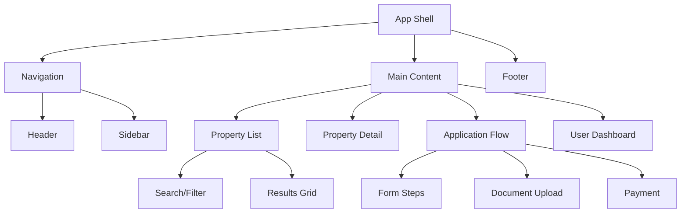

### 3.1.3 Critical User Flows

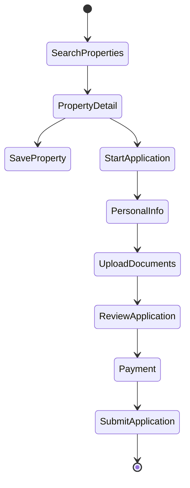

## 3.2 Database Design

### 3.2.1 Schema Design

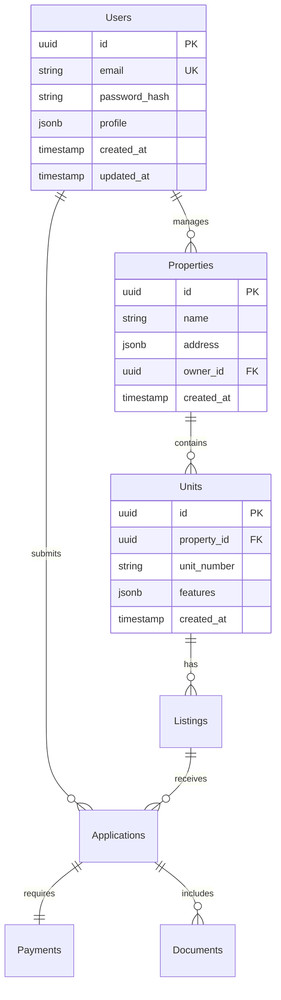

### 3.2.2 Data Management Strategy

| Aspect | Strategy | Implementation |
|--------|----------|----------------|
| Partitioning | Time-based | Monthly partitions for transactions |
| Indexing | Composite + GiST | Location-based + full-text search |
| Replication | Multi-AZ | Synchronous with failover |
| Backup | Continuous | Point-in-time recovery enabled |
| Archival | Cold Storage | Move to S3 after 2 years |
| Encryption | AES-256 | At rest and in transit |

### 3.2.3 Caching Strategy

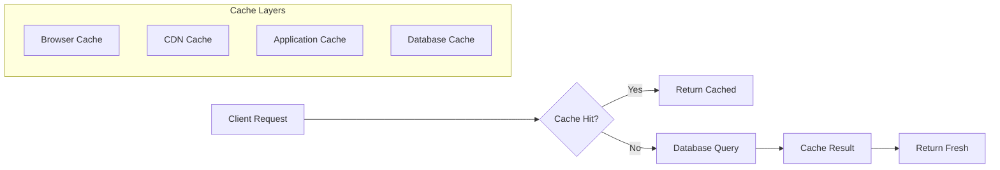

## 3.3 API Design

### 3.3.1 API Architecture

| Component | Specification |
|-----------|--------------|
| Protocol | REST over HTTPS |
| Authentication | OAuth 2.0 + JWT |
| Rate Limiting | 1000 req/min per client |
| Versioning | URI-based (v1, v2) |
| Documentation | OpenAPI 3.0 |
| Format | JSON with UTF-8 |

### 3.3.2 Endpoint Structure

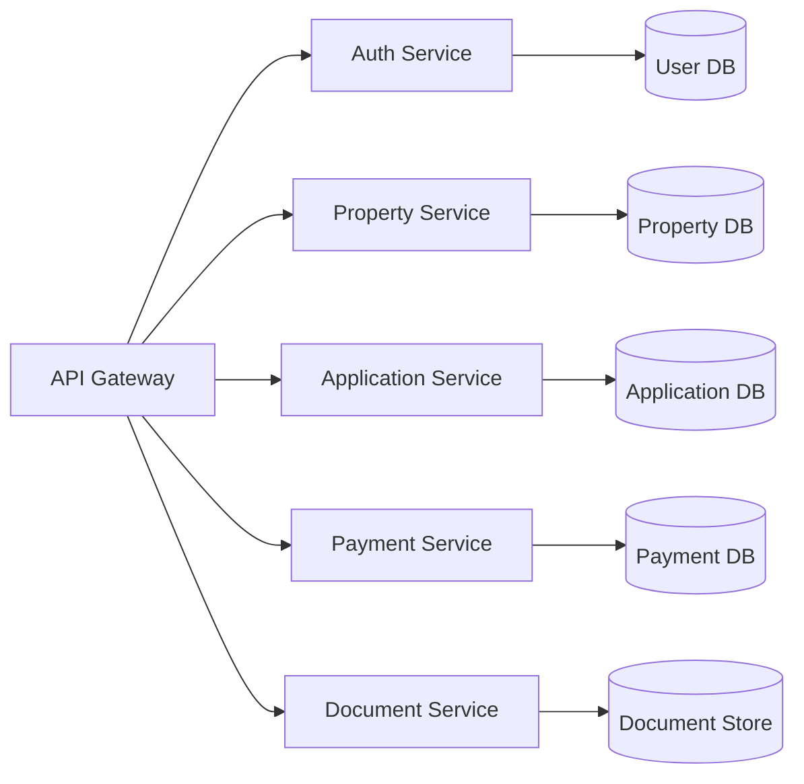

### 3.3.3 Integration Patterns

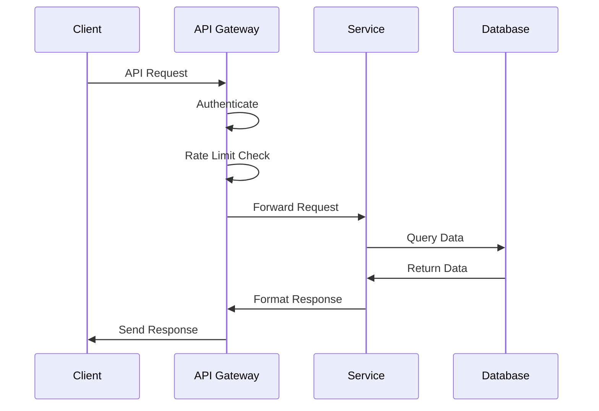

### 3.3.4 Security Controls

| Control | Implementation |
|---------|----------------|
| Authentication | OAuth 2.0 with PKCE |
| Authorization | RBAC with JWT claims |
| Rate Limiting | Token bucket algorithm |
| Input Validation | JSON Schema validation |
| Output Encoding | HTML/SQL escape |
| TLS | Version 1.3 required |

# 4. TECHNOLOGY STACK

## 4.1 PROGRAMMING LANGUAGES

| Platform/Component | Language | Version | Justification |
|-------------------|----------|---------|---------------|
| Backend Services | Node.js | 18 LTS | Event-driven architecture support, extensive package ecosystem, proven scalability |
| Frontend Web | TypeScript | 5.0+ | Type safety, enhanced IDE support, better maintainability |
| iOS Native | Swift | 5.9+ | Native performance, Apple ecosystem integration, modern language features |
| Android Native | Kotlin | 1.9+ | Official Android language, Java interoperability, coroutines support |
| Infrastructure | Go | 1.21+ | High performance for utility services, excellent concurrency model |
| Data Processing | Python | 3.11+ | Rich data processing libraries, ML/AI capabilities |

## 4.2 FRAMEWORKS & LIBRARIES

### Core Frameworks

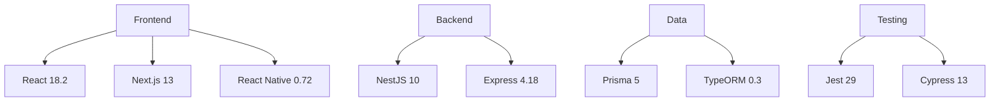

### Supporting Libraries

| Category | Library | Version | Purpose |
|----------|---------|---------|----------|
| State Management | Redux Toolkit | 1.9+ | Centralized state management |
| UI Components | Material-UI | 5.14+ | Design system implementation |
| API Client | Apollo Client | 3.8+ | GraphQL data fetching |
| Form Handling | React Hook Form | 7.45+ | Form validation and management |
| Date/Time | Day.js | 1.11+ | Date manipulation and formatting |
| Validation | Zod | 3.22+ | Runtime type checking |

## 4.3 DATABASES & STORAGE

### Data Architecture

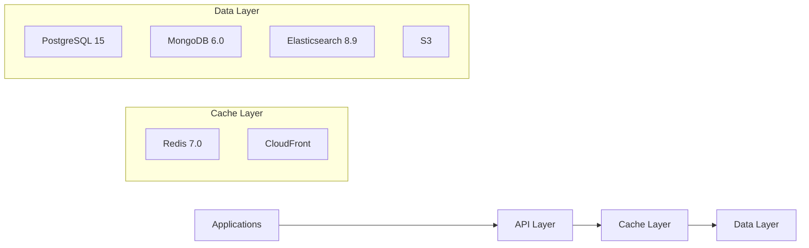

### Storage Strategy

| Data Type | Storage Solution | Purpose | Scaling Strategy |
|-----------|-----------------|---------|------------------|
| Transactional | PostgreSQL | User data, properties, payments | Horizontal sharding |
| Document | MongoDB | Messages, activity logs | Replica sets |
| Search | Elasticsearch | Property search, filtering | Cluster scaling |
| Files | S3 | Documents, images | Native S3 scaling |
| Cache | Redis Cluster | Session data, API responses | Redis clustering |

## 4.4 THIRD-PARTY SERVICES

### Service Integration Architecture

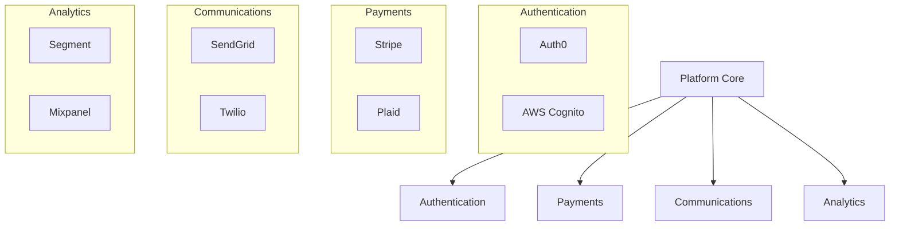

### Service Matrix

| Category | Service | Purpose | SLA Requirement |
|----------|---------|---------|-----------------|
| Authentication | Auth0 | User authentication | 99.99% uptime |
| Payments | Stripe | Payment processing | 99.99% uptime |
| Banking | Plaid | Bank verification | 99.9% uptime |
| Email | SendGrid | Transactional email | 99.9% uptime |
| SMS | Twilio | SMS notifications | 99.95% uptime |
| Monitoring | DataDog | Application monitoring | 99.9% uptime |
| CDN | CloudFront | Content delivery | 99.9% uptime |

## 4.5 DEVELOPMENT & DEPLOYMENT

### CI/CD Pipeline

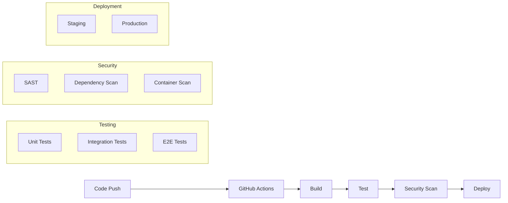

### Development Tools

| Category | Tool | Version | Purpose |
|----------|------|---------|----------|
| IDE | VS Code | Latest | Primary development environment |
| Version Control | Git | 2.40+ | Source code management |
| Container Runtime | Docker | 24.0+ | Application containerization |
| Orchestration | Kubernetes | 1.27+ | Container orchestration |
| IaC | Terraform | 1.5+ | Infrastructure management |
| API Testing | Postman | Latest | API development and testing |
| Monitoring | DataDog | Latest | Application performance monitoring |
| Documentation | Swagger | 3.0 | API documentation |

# 5. SYSTEM DESIGN

## 5.1 User Interface Design

### 5.1.1 Layout Structure

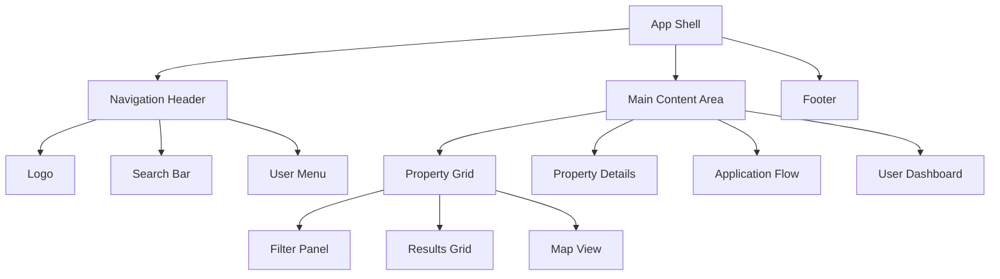

### 5.1.2 Core Components

| Component | Purpose | Key Features |
|-----------|---------|--------------|
| Navigation Header | Global navigation | Responsive, sticky positioning, search integration |
| Property Card | Listing display | Image carousel, quick actions, save functionality |
| Application Form | Data collection | Multi-step wizard, progress tracking, validation |
| Dashboard | User management | Activity feed, property management, messaging |
| Payment Flow | Transaction handling | Secure input, multiple payment methods, receipts |

### 5.1.3 Responsive Breakpoints

| Breakpoint | Width | Layout Changes |
|------------|-------|----------------|
| Mobile | < 768px | Single column, collapsed navigation |
| Tablet | 768px - 1024px | Two columns, expanded navigation |
| Desktop | > 1024px | Three columns, full navigation |
| Large Desktop | > 1440px | Four columns, enhanced features |

## 5.2 Database Design

### 5.2.1 Schema Architecture

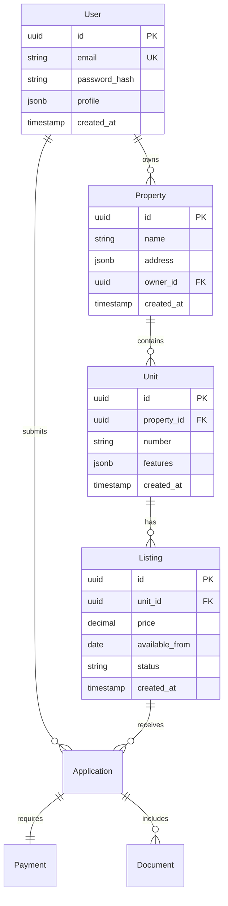

### 5.2.2 Data Storage Strategy

| Data Type | Storage Solution | Purpose |
|-----------|-----------------|----------|
| User Data | PostgreSQL | Transactional data, relationships |
| Messages | MongoDB | Unstructured communication data |
| Documents | S3 | File storage for leases, documents |
| Search Index | Elasticsearch | Property and listing search |
| Cache | Redis | Session data, frequent queries |

## 5.3 API Design

### 5.3.1 API Architecture

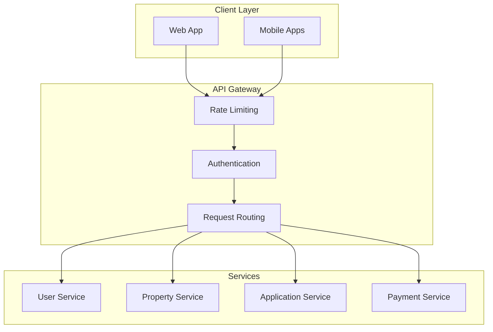

### 5.3.2 API Endpoints

| Endpoint | Method | Purpose | Authentication |
|----------|--------|---------|----------------|
| /api/v1/properties | GET | List properties | Optional |
| /api/v1/properties/{id} | GET | Property details | Optional |
| /api/v1/applications | POST | Submit application | Required |
| /api/v1/payments | POST | Process payment | Required |
| /api/v1/users/me | GET | User profile | Required |

### 5.3.3 Authentication Flow

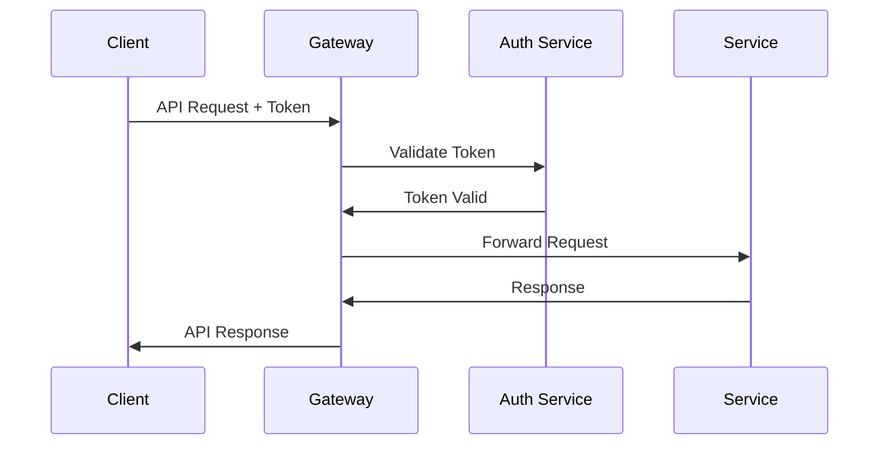

### 5.3.4 Error Handling

| Error Code | Description | Response Format |
|------------|-------------|-----------------|
| 400 | Bad Request | {error: string, details: object} |
| 401 | Unauthorized | {error: string, code: string} |
| 403 | Forbidden | {error: string, required_role: string} |
| 404 | Not Found | {error: string, resource: string} |
| 500 | Server Error | {error: string, reference: string} |

# 6. USER INTERFACE DESIGN

## 6.1 Design System

### Component Library
- Framework: Material-UI v5
- Base Theme: Light/Dark modes
- Typography: System font stack (-apple-system, BlinkMacSystemFont, Segoe UI)
- Grid: 12-column responsive layout
- Spacing: 8px base unit (8, 16, 24, 32, 48, 64px)
- Breakpoints: Mobile (<768px), Tablet (768-1024px), Desktop (>1024px)

### Icon Key
```
[?] - Help/Information tooltip
[$] - Payment/Financial action
[i] - Information indicator
[+] - Add/Create new item
[x] - Close/Delete/Remove
[<] [>] - Navigation arrows
[^] - Upload functionality
[#] - Menu/Dashboard
[@] - User profile
[!] - Alert/Warning
[=] - Settings menu
[*] - Favorite/Important
```

## 6.2 Core Screens

### 6.2.1 Property Search Dashboard
```
+----------------------------------------------------------+
|  [#] Project X    [@]Profile  [$]Payments  [?]Help   [=]  |
+----------------------------------------------------------+
|                                                           |
|  [...........] Search Properties         [Filter v]       |
|                                                           |
|  Popular Neighborhoods:                                   |
|  [*]Downtown  [*]Westside  [*]University District         |
|                                                           |
|  +------------------------+  +------------------------+    |
|  | [img] Property 1      |  | [img] Property 2      |    |
|  | $2,100/month         |  | $1,850/month         |    |
|  | 2 bed, 2 bath        |  | 1 bed, 1 bath        |    |
|  | [*] Save  [>]Details |  | [*] Save  [>]Details |    |
|  +------------------------+  +------------------------+    |
|                                                           |
|  [< 1 2 3 ... >] Page Navigation                         |
+----------------------------------------------------------+
```

### 6.2.2 Property Application Flow
```
+----------------------------------------------------------+
|                   Rental Application                       |
+----------------------------------------------------------+
|  Progress: [============================__________] 70%    |
|                                                           |
|  Step 3 of 5: Personal Information                        |
|                                                           |
|  Name:        [..............................]            |
|  Email:       [..............................]            |
|  Phone:       [..............................]            |
|                                                           |
|  Employment Status:                                       |
|  (•) Employed  ( ) Self-Employed  ( ) Student            |
|                                                           |
|  Documents:                                              |
|  [^] Upload ID         [Complete]                        |
|  [^] Proof of Income   [Pending]                         |
|                                                          |
|  [< Back]                              [Continue >]      |
+----------------------------------------------------------+
```

### 6.2.3 Property Manager Dashboard
```
+----------------------------------------------------------+
|  [#] Dashboard    Properties: 12    Applications: 5 [!]   |
+----------------------------------------------------------+
|                                                           |
|  +-- Active Listings (8)                                  |
|      +-- 123 Main St                                      |
|          |  Unit 101 - [$]1,500/mo  [3] Applications     |
|          |  Unit 102 - [$]1,600/mo  [0] Applications     |
|      +-- 456 Oak Ave                                      |
|          |  Unit 201 - [$]2,000/mo  [2] Applications     |
|                                                           |
|  Recent Activity:                                         |
|  [!] New Application - Unit 101 - Sarah Smith            |
|  [i] Lease Signed - Unit 304 - John Doe                  |
|  [$] Payment Received - Unit 201 - $2,000                |
|                                                           |
|  Quick Actions:                                           |
|  [+] Add Property  [$] Process Payment  [?] Support      |
+----------------------------------------------------------+
```

### 6.2.4 Mobile Property View
```
+------------------+
|  [<] [*] [=]    |
+------------------+
|   [Image 1/4]   |
|    [< > ]       |
+------------------+
| Luxury Downtown  |
| $2,400/month    |
+------------------+
| Details:        |
| • 2 Bed, 2 Bath |
| • 1,200 sq.ft   |
| • Pet Friendly  |
+------------------+
| [Schedule Tour]  |
| [Apply Now]      |
+------------------+
| [@] Agent Info   |
| [?] Questions    |
+------------------+
```

## 6.3 Interaction Patterns

### Navigation Flow
```
Home
 |
 +-- Property Search
 |   +-- Filter Results
 |   +-- Property Details
 |       +-- Photo Gallery
 |       +-- Apply Now
 |           +-- Application Steps
 |               +-- Personal Info
 |               +-- Documents
 |               +-- Review & Submit
 |
 +-- User Dashboard
     +-- Saved Properties
     +-- Applications
     +-- Messages
     +-- Payments
```

### Modal Patterns
```
+----------------------------------+
|  Confirmation Dialog        [x]  |
+----------------------------------+
|                                  |
|  [!] Save changes before exit?   |
|                                  |
|  [Cancel]        [Save Changes]  |
+----------------------------------+
```

## 6.4 Responsive Behavior

### Desktop to Mobile Adaptation
```
Desktop:
+----------------+------------------+
|  Sidebar Nav   |  Main Content   |
|  [#] [=] [@]   |  [...........] |
+----------------+------------------+

Mobile:
+------------------+
|  [=] Title [#]  |
+------------------+
|  Main Content   |
|  [...........]  |
+------------------+
|  [Home][Search] |
|  [@Profile][=]  |
+------------------+
```

# 7. SECURITY CONSIDERATIONS

## 7.1 AUTHENTICATION AND AUTHORIZATION

### Authentication Strategy

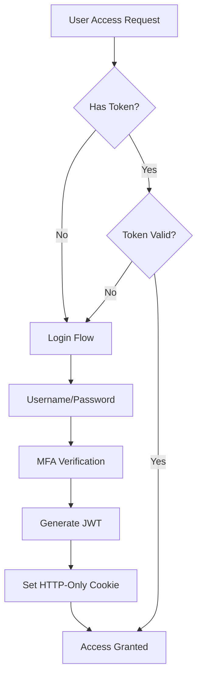

| Authentication Method | Implementation | Purpose |
|----------------------|----------------|----------|
| OAuth 2.0 + OIDC | Auth0 integration | Primary authentication protocol |
| MFA | TOTP via Auth0 | Additional security layer |
| Social Login | Google, Apple, Facebook | Alternative authentication options |
| Magic Links | SendGrid email service | Passwordless authentication |
| Biometric | TouchID/FaceID | Mobile app authentication |

### Authorization Framework

| Role | Access Level | Permissions |
|------|-------------|-------------|
| Renter | Basic | Search listings, submit applications, view own profile |
| Property Manager | Advanced | Manage properties, review applications, access reports |
| Agent | Intermediate | View listings, manage clients, receive commissions |
| Admin | Full | System configuration, user management, audit logs |

## 7.2 DATA SECURITY

### Encryption Strategy

```mermaid
flowchart LR
    subgraph Data at Rest
        A[AES-256] --> B[AWS KMS]
        B --> C[Encrypted Storage]
    end
    
    subgraph Data in Transit
        D[TLS 1.3] --> E[Certificate Management]
        E --> F[Secure Communication]
    end
    
    subgraph Key Management
        G[AWS KMS] --> H[Key Rotation]
        H --> I[Access Control]
    end
```

### Data Protection Measures

| Data Type | Protection Method | Implementation |
|-----------|------------------|----------------|
| PII | Field-level encryption | AES-256 with unique keys |
| Financial Data | PCI DSS compliance | Tokenization via Stripe |
| Documents | Encrypted storage | S3 with server-side encryption |
| Passwords | Salted hashing | Argon2id algorithm |
| Session Data | Encrypted cookies | HTTP-only, Secure flags |

## 7.3 SECURITY PROTOCOLS

### Security Implementation

```mermaid
flowchart TD
    subgraph Perimeter Security
        A[WAF] --> B[DDoS Protection]
        B --> C[Rate Limiting]
    end
    
    subgraph Application Security
        D[Input Validation] --> E[XSS Prevention]
        E --> F[CSRF Protection]
        F --> G[SQL Injection Prevention]
    end
    
    subgraph Monitoring
        H[Security Logging] --> I[Intrusion Detection]
        I --> J[Alert System]
    end
```

### Security Controls

| Control Type | Implementation | Description |
|-------------|----------------|-------------|
| WAF | AWS WAF | Filters malicious traffic |
| Rate Limiting | Token bucket algorithm | Prevents abuse and DDoS |
| CORS | Strict origin policy | Controls resource access |
| CSP | Level 2 policy | Prevents XSS attacks |
| Audit Logging | CloudWatch + DataDog | Security event tracking |
| Vulnerability Scanning | Weekly automated scans | Identifies security issues |

### Compliance Requirements

| Standard | Implementation | Verification |
|----------|----------------|-------------|
| SOC 2 Type II | Annual audit | Third-party certification |
| GDPR | Data privacy controls | Regular assessments |
| CCPA | User consent management | Compliance monitoring |
| PCI DSS | Payment security | Quarterly scans |
| NIST 800-53 | Security controls | Annual review |

### Security Response Plan

```mermaid
flowchart LR
    A[Security Event] --> B{Severity Level}
    B -->|High| C[Immediate Response]
    B -->|Medium| D[Standard Response]
    B -->|Low| E[Scheduled Response]
    
    C --> F[Incident Team]
    D --> G[Security Team]
    E --> H[Development Team]
    
    F --> I[Resolution]
    G --> I
    H --> I
    
    I --> J[Post-Mortem]
```

# 8. INFRASTRUCTURE

## 8.1 DEPLOYMENT ENVIRONMENT

```mermaid
flowchart TD
    subgraph Production
        A[Multi-Region AWS]
        B[CDN Edge Locations]
        C[Disaster Recovery Region]
    end
    
    subgraph Staging
        D[Single Region AWS]
        E[Reduced Infrastructure]
    end
    
    subgraph Development
        F[Local Development]
        G[Development AWS Account]
    end
    
    A --> B
    A --> C
    D --> A
    F --> D
    G --> D
```

| Environment | Infrastructure | Purpose | Scaling |
|-------------|---------------|----------|----------|
| Production | Multi-AZ AWS deployment | Live system serving users | Auto-scaling with min 3 nodes |
| Staging | Single-AZ AWS deployment | Pre-production testing | Fixed 2 node deployment |
| Development | Local + AWS dev account | Development and testing | On-demand resources |
| DR | Secondary AWS region | Business continuity | Warm standby |

## 8.2 CLOUD SERVICES

| Service Category | AWS Service | Purpose | Configuration |
|-----------------|-------------|----------|---------------|
| Compute | EKS | Container orchestration | 1.27+ managed Kubernetes |
| Serverless | Lambda | Event processing | Node.js 18 runtime |
| Database | RDS Aurora | Primary database | Multi-AZ PostgreSQL 15 |
| Caching | ElastiCache | Application caching | Redis 7.0 cluster |
| Storage | S3 | Document storage | Standard + Glacier |
| CDN | CloudFront | Content delivery | Edge locations worldwide |
| DNS | Route 53 | DNS management | Active-active routing |
| Load Balancing | ALB | Traffic distribution | Cross-zone enabled |
| Monitoring | CloudWatch | System monitoring | Custom metrics enabled |
| Security | WAF & Shield | DDoS protection | Enterprise shield |

## 8.3 CONTAINERIZATION

### Container Architecture

```mermaid
graph TB
    subgraph Base Images
        A[Node 18 Alpine]
        B[Nginx Alpine]
    end
    
    subgraph Application Containers
        C[API Services]
        D[Frontend Apps]
        E[Background Workers]
    end
    
    subgraph Supporting Services
        F[Redis]
        G[MongoDB]
        H[Elasticsearch]
    end
    
    A --> C
    A --> E
    B --> D
    C --> F
    C --> G
    C --> H
```

### Container Specifications

| Container Type | Base Image | Resource Limits | Scaling Strategy |
|---------------|------------|-----------------|------------------|
| API Services | node:18-alpine | 2 CPU, 4GB RAM | Horizontal auto-scaling |
| Frontend | nginx:alpine | 1 CPU, 2GB RAM | Horizontal auto-scaling |
| Workers | node:18-alpine | 2 CPU, 4GB RAM | Queue-based scaling |
| Cache | redis:7.0-alpine | 2 CPU, 4GB RAM | Cluster scaling |
| Search | elasticsearch:8.9 | 4 CPU, 8GB RAM | Cluster scaling |

## 8.4 ORCHESTRATION

### Kubernetes Architecture

```mermaid
graph TB
    subgraph EKS Cluster
        A[Ingress Controller]
        B[Service Mesh]
        
        subgraph Application Pods
            C[API Pods]
            D[Frontend Pods]
            E[Worker Pods]
        end
        
        subgraph Platform Services
            F[Monitoring]
            G[Logging]
            H[Service Discovery]
        end
    end
    
    A --> C
    A --> D
    B --> C
    B --> D
    B --> E
    C --> F
    D --> F
    E --> F
```

### Kubernetes Components

| Component | Implementation | Purpose |
|-----------|---------------|----------|
| Service Mesh | Istio 1.18+ | Traffic management, security |
| Ingress | NGINX Ingress | External traffic routing |
| Monitoring | Prometheus + Grafana | Metrics and visualization |
| Logging | EFK Stack | Log aggregation |
| Auto-scaling | HPA + VPA | Resource optimization |
| Config Management | ConfigMaps + Secrets | Application configuration |

## 8.5 CI/CD PIPELINE

### Pipeline Architecture

```mermaid
flowchart LR
    A[Code Push] --> B[Build]
    B --> C[Test]
    C --> D[Security Scan]
    D --> E[Deploy Staging]
    E --> F[Integration Tests]
    F --> G[Deploy Production]
    
    subgraph Security
        D1[SAST]
        D2[Container Scan]
        D3[Dependency Check]
    end
    
    subgraph Testing
        C1[Unit Tests]
        C2[E2E Tests]
        C3[Code Coverage]
    end
    
    D --> D1
    D --> D2
    D --> D3
    C --> C1
    C --> C2
    C --> C3
```

### Pipeline Specifications

| Stage | Tools | SLA | Automation |
|-------|-------|-----|------------|
| Source Control | GitHub Enterprise | < 5 min | Branch protection |
| Build | GitHub Actions | < 10 min | Automated builds |
| Test | Jest, Cypress | < 15 min | Parallel testing |
| Security | Snyk, SonarQube | < 10 min | Automated scanning |
| Deployment | ArgoCD | < 15 min | GitOps workflow |
| Monitoring | DataDog | Real-time | Automated alerts |

### Deployment Strategy

| Environment | Strategy | Rollback Time | Validation |
|-------------|----------|---------------|------------|
| Staging | Blue/Green | < 5 minutes | Automated tests |
| Production | Canary | < 10 minutes | Progressive traffic |
| DR | Active-Passive | < 30 minutes | Regular testing |
| Feature Flags | LaunchDarkly | Immediate | A/B testing |

# 8. APPENDICES

## 8.1 Additional Technical Information

### Development Environment Setup

```mermaid
flowchart LR
    A[Local Dev] --> B[Git]
    B --> C[GitHub Actions]
    C --> D[Build Pipeline]
    D --> E[Test Environment]
    E --> F[Staging]
    F --> G[Production]

    subgraph Local Tools
        VSCode[VS Code]
        Docker[Docker Desktop]
        Node[Node.js 18]
        AWS[AWS CLI]
    end

    subgraph CI Tools
        Jest[Jest]
        ESLint[ESLint]
        Prettier[Prettier]
        Husky[Husky]
    end
```

### System Health Monitoring

| Metric Type | Tool | Threshold | Alert Priority |
|-------------|------|-----------|----------------|
| Server CPU | DataDog | >80% for 5min | High |
| Memory Usage | DataDog | >85% for 5min | High |
| API Latency | New Relic | >500ms avg | Medium |
| Error Rate | Sentry | >1% of requests | High |
| Disk Usage | CloudWatch | >85% capacity | Medium |
| Queue Depth | CloudWatch | >1000 messages | Medium |

## 8.2 Glossary

| Term | Definition |
|------|------------|
| Blue/Green Deployment | Deployment strategy using two identical environments for zero-downtime updates |
| Circuit Breaker | Design pattern that prevents cascading failures in distributed systems |
| Event Sourcing | Pattern of storing changes to application state as a sequence of events |
| Feature Flag | Configuration that enables/disables functionality without code deployment |
| Idempotency | Property where an operation produces the same result regardless of repetition |
| Service Mesh | Infrastructure layer handling service-to-service communication |
| Tenant | A user or organization in a multi-tenant system |
| Warm Standby | Disaster recovery configuration where backup systems run continuously |
| Zero Trust | Security model that requires verification for all system access |

## 8.3 Acronyms

| Acronym | Full Form |
|---------|-----------|
| ACID | Atomicity, Consistency, Isolation, Durability |
| ALB | Application Load Balancer |
| CQRS | Command Query Responsibility Segregation |
| DDD | Domain-Driven Design |
| ECS | Elastic Container Service |
| EFS | Elastic File System |
| ELK | Elasticsearch, Logstash, Kibana |
| GDPR | General Data Protection Regulation |
| OIDC | OpenID Connect |
| PKCE | Proof Key for Code Exchange |
| RDS | Relational Database Service |
| SAST | Static Application Security Testing |
| SLA | Service Level Agreement |
| SOC | System and Organization Controls |
| VPA | Vertical Pod Autoscaler |
| WAF | Web Application Firewall |
| YAML | YAML Ain't Markup Language |

## 8.4 Reference Architecture

```mermaid
graph TB
    subgraph Frontend
        Web[Web App]
        Mobile[Mobile Apps]
        Admin[Admin Portal]
    end

    subgraph Gateway
        ALB[Load Balancer]
        CDN[CloudFront]
        WAF[WAF]
    end

    subgraph Services
        Auth[Auth Service]
        API[API Gateway]
        Queue[SQS/EventBridge]
    end

    subgraph Storage
        RDS[(Aurora PostgreSQL)]
        Redis[(Redis)]
        S3[(S3)]
    end

    subgraph Monitoring
        Logs[CloudWatch]
        Metrics[DataDog]
        Traces[X-Ray]
    end

    Frontend --> Gateway
    Gateway --> Services
    Services --> Storage
    Services --> Monitoring
```

## 8.5 Security Controls Matrix

| Control Category | Implementation | Compliance Requirement |
|-----------------|----------------|----------------------|
| Access Control | AWS IAM + RBAC | SOC 2, ISO 27001 |
| Data Protection | KMS + Field-level Encryption | GDPR, CCPA |
| Network Security | Security Groups + NACLs | PCI DSS |
| Audit Logging | CloudTrail + CloudWatch | SOX |
| Identity Management | Cognito + MFA | NIST 800-53 |
| Vulnerability Management | AWS Inspector + GuardDuty | ISO 27001 |
| Business Continuity | Multi-AZ + Cross-region DR | SOC 2 |