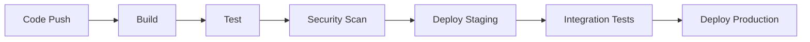

# Project X Backend

Enterprise-grade rental marketplace platform backend built with Node.js microservices architecture.

## System Architecture

### Core Services

| Service | Port | Purpose |
|---------|------|---------|
| API Gateway | 3000 | Request routing, authentication, rate limiting |
| Auth Service | 3001 | User authentication, authorization, token management |
| Listing Service | 3002 | Property listing management and search |
| Application Service | 3003 | Rental application processing |
| Payment Service | 3004 | Payment processing and tracking |
| Notification Service | 3005 | Communication management |

### Data Stores

| Store | Port | Purpose |
|-------|------|---------|
| PostgreSQL | 5432 | Primary transactional database |
| Redis | 6379 | Caching, session management, rate limiting |
| Elasticsearch | 9200 | Property search and indexing |

## Prerequisites

- Node.js >= 18.0.0
- npm >= 9.0.0
- Docker >= 24.0.0
- Docker Compose >= 2.20.0
- AWS CLI >= 2.13.0
- Git >= 2.40.0

## Getting Started

1. Clone the repository:
```bash
git clone <repository-url>
cd project-x-backend
```

2. Set up environment variables:
```bash
cp .env.example .env
# Update .env with your configuration
```

3. Install dependencies:
```bash
npm install
npm run bootstrap
```

4. Start development environment:
```bash
docker-compose up -d
npm run dev
```

## Development

### Project Structure
```
src/backend/
├── packages/
│   ├── api-gateway/       # API Gateway service
│   ├── auth-service/      # Authentication service
│   ├── listing-service/   # Property listing service
│   ├── application-service/ # Application processing
│   ├── payment-service/   # Payment processing
│   ├── notification-service/ # Communication service
│   └── common/           # Shared utilities and types
├── docker-compose.yml    # Local development orchestration
├── Dockerfile           # Production container build
├── package.json         # Root package configuration
└── lerna.json          # Monorepo management
```

### Available Scripts

| Command | Purpose |
|---------|---------|
| `npm run bootstrap` | Install all dependencies |
| `npm run build` | Build all packages |
| `npm run test` | Run test suites |
| `npm run test:coverage` | Run tests with coverage |
| `npm run lint` | Lint code |
| `npm run format` | Format code |
| `npm run dev` | Start development servers |
| `npm run docker:build` | Build Docker images |
| `npm run docker:up` | Start Docker environment |
| `npm run docker:down` | Stop Docker environment |
| `npm run security:audit` | Run security audit |
| `npm run performance:test` | Run performance tests |

### API Documentation

API documentation is available at:
- Development: http://localhost:3000/api/docs
- Staging: https://api-staging.projectx.com/docs
- Production: https://api.projectx.com/docs

### Security

- Authentication: OAuth 2.0 + JWT
- Authorization: RBAC with granular permissions
- Rate Limiting: Redis-based, 1000 req/min per client
- Input Validation: Joi schema validation
- Security Headers: Helmet middleware
- Data Encryption: AES-256 for sensitive data
- SSL/TLS: Required for all endpoints

### Monitoring

- Metrics: Prometheus + Grafana
- Logging: ELK Stack (Elasticsearch, Logstash, Kibana)
- Tracing: Jaeger
- Alerting: PagerDuty
- Health Checks: /health endpoint on all services

### CI/CD Pipeline



### Performance Optimization

- Redis Caching: Frequently accessed data
- Connection Pooling: Database connections
- Rate Limiting: Prevent abuse
- Load Balancing: Horizontal scaling
- Circuit Breaking: Prevent cascading failures

### Deployment

Production deployment uses:
- AWS ECS for container orchestration
- AWS ALB for load balancing
- AWS RDS for PostgreSQL
- AWS ElastiCache for Redis
- AWS Elasticsearch Service
- AWS S3 for file storage

### Contributing

1. Create feature branch: `git checkout -b feature/name`
2. Commit changes: `git commit -am 'Add feature'`
3. Push branch: `git push origin feature/name`
4. Submit pull request

### License

Private and Confidential - Project X © 2023